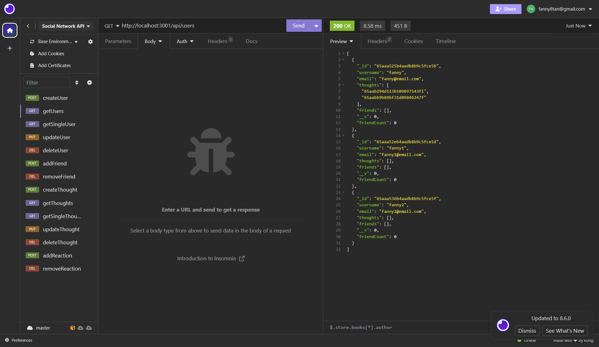

# Social Network API

## Description
An API for a social network web application where users can share their thoughts, react to friends’ thoughts, and create a friend list. the APIuse Express.js for routing, a MongoDB database, and the Mongoose ODM. In addition to using the Express.js and Mongoose packages.

## Mock-Up

## GitHub Repo
https://github.com/FannyCandy/18_Social_Network_API

## Walkthrough video
https://drive.google.com/file/d/1D3CgLc3fXf7URxlxOQeDfkmVYcafYnjz/view?usp=sharing

## Credit / Resources used
NU BootCamp curriculum